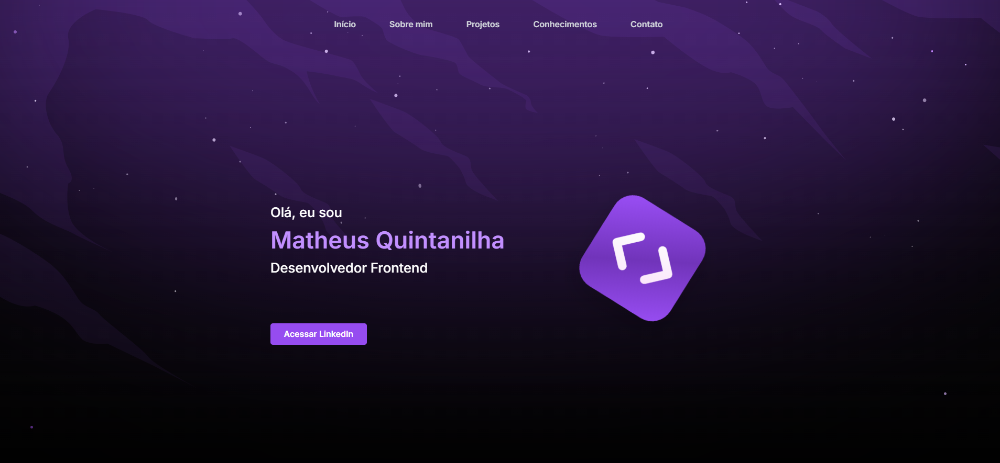

# 🚀 Portfólio | Matheus Quintanilha

Bem-vindo ao meu portfólio! Aqui você encontra meus principais projetos desenvolvidos com foco em **Frontend Moderno**, utilizando as melhores práticas do mercado e tecnologias de ponta.



---

## ✨ Sobre

Este portfólio foi criado para apresentar meus projetos, habilidades e experiências como **Desenvolvedor Frontend**. Busco sempre entregar soluções escaláveis, performáticas e com excelente experiência de usuário.

---

## 🛠️ Stack Principal

- **React 18** + **TypeScript**
- **Vite** (build ultra-rápido)
- **Tailwind CSS** (UI moderna e responsiva)
- **shadcn/ui** (componentização elegante)
- **React Query** (data fetching e cache)
- **Recharts** (gráficos interativos)
- **Context API** (gerenciamento de estado)
- **ESLint + Prettier** (código limpo e padronizado)

---

## 🌟 Principais Projetos

| Projeto                       | Tecnologias                                | Demo / Código                                                                                                               |
| ----------------------------- | ------------------------------------------ | --------------------------------------------------------------------------------------------------------------------------- |
| **Crypto Dashboard**          | React, TypeScript, React Query, Recharts   | [Demo](https://crypto-dashboard-gamma-kohl.vercel.app/) / [GitHub](https://github.com/MatheusQuintanilhaa/crypto-dashboard) |
| **Fashion E-commerce**        | Next.js, TypeScript, Tailwind, Context API | [Demo](https://fashion-ecommerce-blue.vercel.app/) / [GitHub](https://github.com/MatheusQuintanilhaa/fashion-ecommerce)     |
| **LinkShort - URL Shortener** | React, Vite, Tailwind, JavaScript          | [Demo](https://url-shortener-wine-psi.vercel.app/) / [GitHub](https://github.com/MatheusQuintanilhaa/url-shortener)         |
| **PetHelpful (Chatbot IA)**   | Python, Google Gemini AI, API Integration  | [GitHub](https://github.com/MatheusQuintanilhaa/chatbot-pethelful)                                                          |

---

## 🚩 Diferenciais

- **Performance:** Lighthouse Score 90+ em todos os projetos
- **Responsividade:** Mobile-first em toda a interface
- **Acessibilidade:** Foco em boas práticas de acessibilidade web
- **Código limpo:** Componentização, tipagem forte e padronização
- **Deploy contínuo:** Projetos hospedados no Vercel

---

## 📦 Como rodar localmente

```bash
# Clone o repositório
git clone https://github.com/MatheusQuintanilhaa/portfolio-2.git

# Instale as dependências
npm install

# Rode o projeto
npm run dev

# Acesse em http://localhost:5173
```

---

## 💡 Aprendizados & Desafios

- Integração de múltiplas APIs públicas e privadas
- Otimização de performance e bundle size
- Criação de hooks customizados e componentes reutilizáveis
- Implementação de dark mode e temas dinâmicos
- Deploy automatizado com Vercel

---

## 📫 Contato

- **LinkedIn:** [matheus-quintanilhadev](https://www.linkedin.com/in/matheus-quintanilhadev/)
- **E-mail:** matheussantos.quintanilha@gmail.com
- **Portfólio Online:** [Acesse aqui](https://portflio-matheus-quintanilha.vercel.app/)

---
